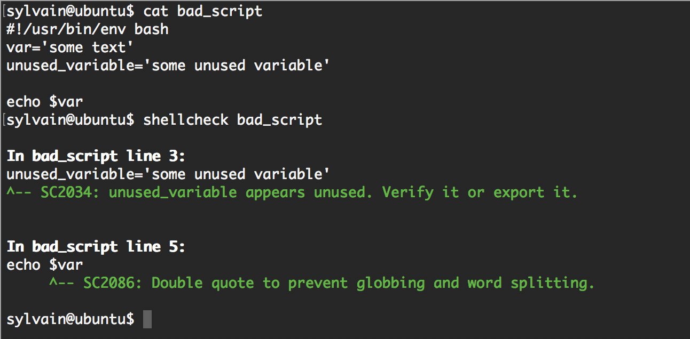
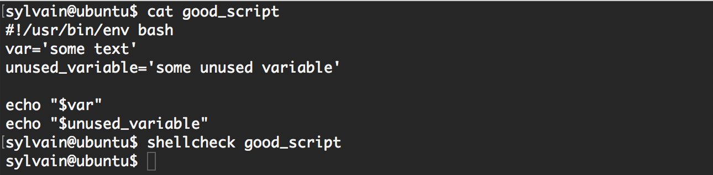

# 0x04. Loops, conditions and parsing

## About Bash projects

Unless stated, all your projects will be auto-corrected with Ubuntu 20.04 LTS.

## Resources
- Loops sample
- Variable assignment and arithmetic
- Comparison operators
- File test operators
- Make your scripts portable

## Requirements
1. General
- How to create SSH keys
- What is the advantage of using #!/usr/bin/env bash over #!/bin/bash
- How to use while, until and for loops
- How to use if, else, elif and case condition statements
- How to use the cut command
- What are files and other comparison operators, and how to use them

2. Copyright - Plagiarism
- You are tasked to come up with solutions for the tasks below yourself to meet with the above learning objectives.
- You will not be able to meet the objectives of this or any following project by copying and pasting someone else’s work.
- You are not allowed to publish any content of this project.
- Any form of plagiarism is strictly forbidden and will result in removal from the program.

3. Shellcheck
- Shellcheck is a tool that will help you write proper Bash scripts. It will make recommendations on your syntax and semantics and provide advice on edge cases that you might not have thought about. Shellcheck is your friend! All your Bash scripts must pass Shellcheck without any error or you will not get any points on the task.
- Shellcheck is available on the school’s computers. If you want to use it on your own computer, here is how to install it.

Example

