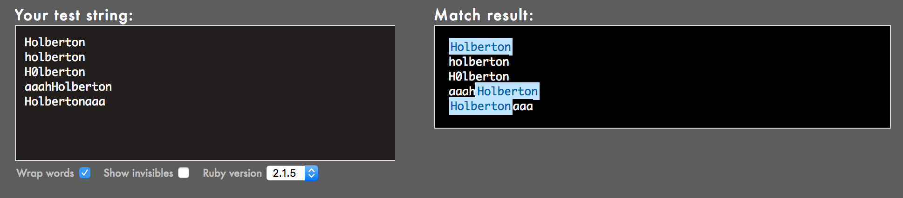
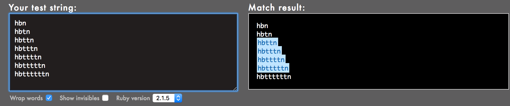
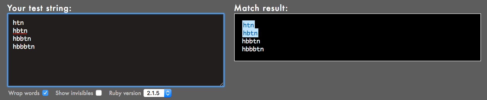
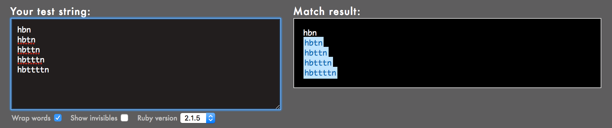
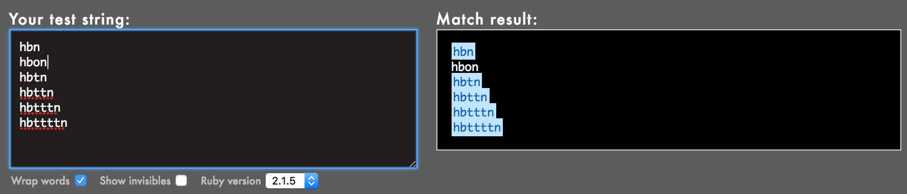
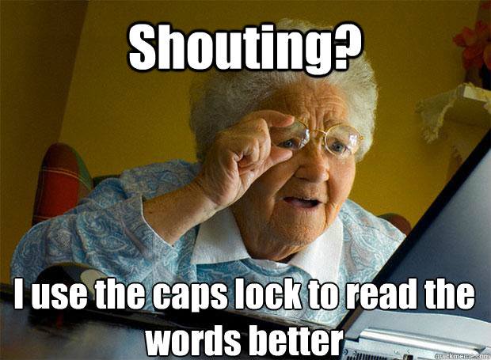

# 0x06. Regular expression
A regular expression, commonly called a “regexp”, is a sequence of characters that define a search pattern.  It is mainly for use in pattern matching with strings, or string matching (i.e. it operates like a “find and replace” command). While it is a very powerful tool, it is also very dangerous because of its complexity.

# Resources
[Regular expressions - basics](https://www.slideshare.net/neha_jain/introducing-regular-expressions)
[Regular expressions - advanced](https://www.slideshare.net/neha_jain/advanced-regular-expressions-80296518)
[Rubular is your best friend](https://rubular.com/)
[Use a regular expression against a problem: now you have 2 problems](https://blog.codinghorror.com/regular-expressions-now-you-have-two-problems/)
[Learn Regular Expressions with simple, interactive exercises](https://regexone.com/)

## General
- Allowed editors: vi, vim, emacs
- All your files will be interpreted on Ubuntu 20.04 LTS
- All your files should end with a new line
- A README.md file, at the root of the folder of the project, is mandatory
- All your Bash script files must be executable
- The first line of all your Bash scripts should be exactly #!/usr/bin/env ruby
- All your regex must be built for the Oniguruma library

## Tasks
0. Create a Ruby script that accepts one argument and pass it to a regular expression matching method

1. Create a Ruby script that accepts one argument and pass it to a regular expression matching method

2. Create a Ruby script that accepts one argument and pass it to a regular expression matching method

3. Create a Ruby script that accepts one argument and pass it to a regular expression matching method

4. Create a Ruby script that accepts one argument and pass it to a regular expression matching method

5. Create a Ruby script that accepts one argument and pass it to a regular expression matching method
6. This task is brought to you by a professional advisor Neha Jain, Senior Software Engineer at LinkedIn.
    - The regular expression must match a 10 digit phone number
7. The regular expression must be only matching: capital letters

8. For this task, you’ll be taking over Guillaume’s responsibilities: one afternoon, a TextMe VoIP Engineer comes to you and explains she wants to run some statistics on the TextMe app text messages transactions.

Happy learning

----
Created by [**Zablon Kiprotich**]
